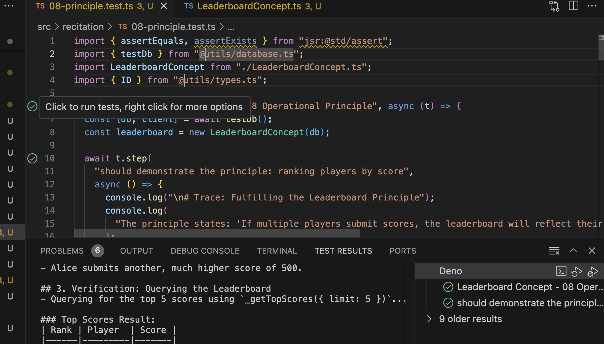

# Recitation: Context and MongoDB

In this recitation, we'll be learning the fundamentals of MongoDB by building a simple `Leaderboard` application. For your prep, you should have forked the `concept_backend` repository for Assignment 4a, which is where your code will be situated. 

**Starting**: clone this repository to any directory, and copy the contents into your project repo (the one you forked from `concept_backend`). There should not be any merging issues, and you may delete the `src/recitation` folder and the `design/learning/recitation.md` files afterward to clean up, as any history will be saved in the `context` folder if you learn something useful from an LLM or `ctx save` your own insights.

### Your Goal

Your task is to implement the functionality for a `Leaderboard` concept. You will be provided with:

1.  `LeaderboardConcept.ts`: A TypeScript class with empty methods. **This is the only file you need to edit.**
2.  A series of test files (`01-setup.test.ts`, `02-createPlayer.test.ts`, etc.): These files are designed to be run in order. Each one tests a specific piece of functionality.

### How to Work Through the Exercise

1.  **Start with `01-setup.test.ts`**. Read the comments to understand what it's testing.
2.  Run the test from your terminal. It should succeed - read the file to understand how tests are written. 
    ```bash
    deno test -A src/recitation/01-setup.test.ts
    ```

    or for all tests:

    ```bash
    deno test -A
    ```

    The next test file, `02-createPlayer.test.ts` should fail.
3.  Go to `src/recitation/LeaderboardConcept.ts` and find the corresponding `// TODO` comment.
4.  Implement the required logic using the MongoDB driver methods.
5.  Run the test again. Once it passes, move on to the next test file.
6.  Repeat this process until all tests pass.

By the end, you will have a fully functional `Leaderboard` and will have used core MongoDB features like creating documents, finding them with filters, sorting, limiting results, and using comparison operators.

### Tip

If you are using VSCode and have the Deno extension installed as suggested, you can easily run Deno's built in tests by clicking the green button that shows up next to tests on the left:



# Getting help and documenting learning

As you try out the exercises, feel free to `ctx prompt` with `design/learning/recitation.md`, adding in a link include to any test you might be struggling with. The link would take the form of:

```md
[@08-principle.test.ts](/src/recitation/08-principle.test.ts)
```

Also, feel free to edit down the existing context - you might need to only include the code files to debug, as the main challenges are purely about MongoDB.

---

# concept: Leaderboard

*   **concept**: Leaderboard
*   **purpose**: To rank players based on scores they achieve.
*   **principle**: If multiple players submit scores, the leaderboard will reflect their rankings, with the highest scores appearing first.
*   **state**:
    ```
    a set of Players with
      a name String

    a set of Scores with
      a player Player
      a value Number
      a submittedAt Date
    ```
*   **actions**:
    *   `createPlayer (name: String): (player: Player)`
        *   **requires**: A player with the given name does not already exist.
        *   **effects**: A new player is created with the given name and a unique ID. Returns the new player's ID.
    *   `submitScore (player: Player, value: Number): (score: Score)`
        *   **requires**: The player with the given ID exists.
        *   **effects**: A new score is recorded for the player with the given value and the current timestamp. Returns the new score's ID.
*   **queries**:
    *   `_getPlayerScores (player: Player): (scores: Score[])`
        *   **effects**: Returns a list of all scores submitted by the specified player.
    *   `_getTopScores (limit: Number): (scores: Score[])`
        *   **effects**: Returns a list of the top scores across all players, sorted from highest to lowest, up to the given limit.
    *   `_getScoresSince (date: Date): (scores: Score[])`
        *   **effects**: Returns a list of all scores submitted at or after the given date.

---

